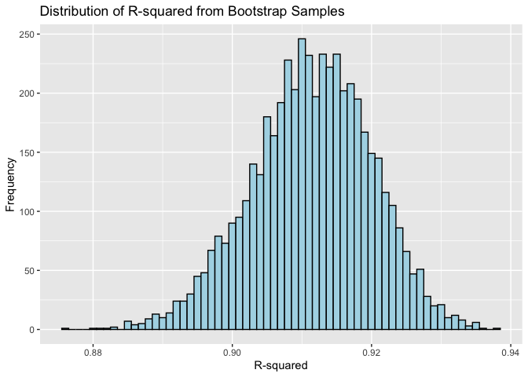
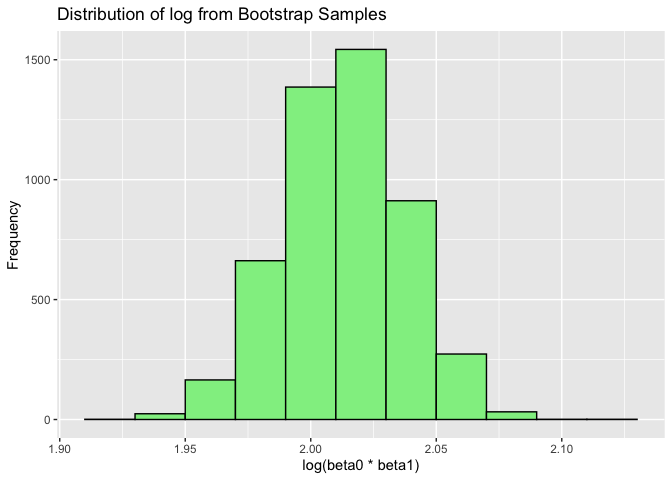
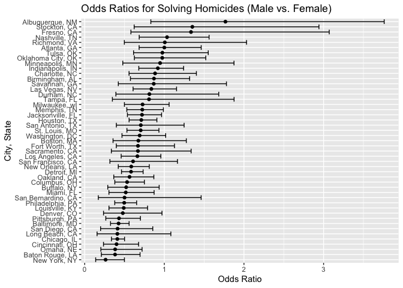
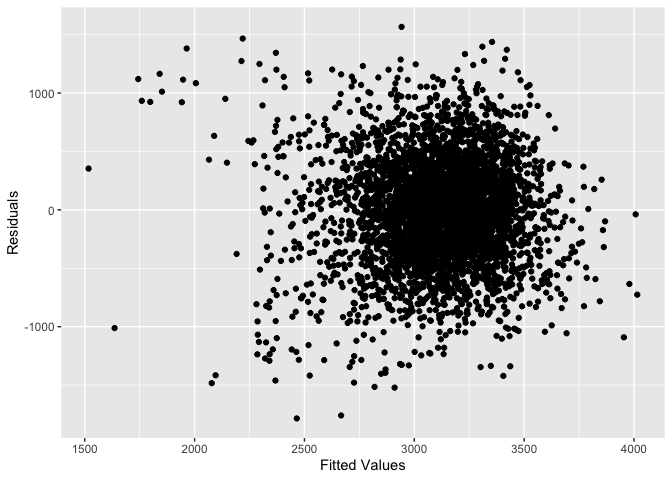
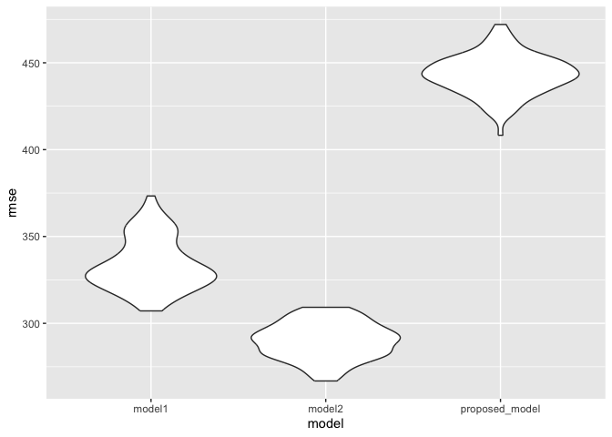

P8105 HW6
================
2024-11-29

# Problem 1

Setting Up

``` r
weather_df = 
  rnoaa::meteo_pull_monitors(
    c("USW00094728"),
    var = c("PRCP", "TMIN", "TMAX"), 
    date_min = "2017-01-01",
    date_max = "2017-12-31") %>%
  mutate(
    name = recode(id, USW00094728 = "CentralPark_NY"),
    tmin = tmin / 10,
    tmax = tmax / 10) %>%
  select(name, id, everything())
```

    ## using cached file: /Users/cindyho/Library/Caches/org.R-project.R/R/rnoaa/noaa_ghcnd/USW00094728.dly

    ## date created (size, mb): 2024-09-26 10:17:30.828386 (8.651)

    ## file min/max dates: 1869-01-01 / 2024-09-30

Creating the Function first.

``` r
boot_fun = function(df) {
  boot_samp = modelr::bootstrap(df, 1)
  
  boot_data = boot_samp[[1]]
  
  lm_fit = lm(tmax ~ tmin, data = boot_data)
  
  glance_out = broom::glance(lm_fit)
  tidy_out = broom::tidy(lm_fit)
  
  return(tibble(
    r_squared = glance_out[['r.squared']], 
    log_est = log(tidy_out[['estimate']][1] * tidy_out[['estimate']][2])  
  ))
}
```

5000 Bootstrap Samples.

``` r
boot_straps = 
  weather_df %>%
  modelr::bootstrap(n = 5000)
```

``` r
boot_results = 
  boot_straps %>% 
  mutate(
    results = map(strap, function(boot_samp) {
      lm_fit = lm(tmax ~ tmin, data = boot_samp)
      
      glance_out = broom::glance(lm_fit)
      tidy_out = broom::tidy(lm_fit)
      
      return(tibble(
        r_squared = glance_out[['r.squared']], 
        log_est = log(tidy_out[['estimate']][1] * tidy_out[['estimate']][2])  
      ))
    })) %>% 
  unnest(results) 
```

Histogram: R Squared

``` r
boot_results %>%
  ggplot(aes(x = r_squared)) +
  geom_histogram(binwidth = 0.001, fill = "lightblue", color = "black") +
  labs(title = "Distribution of R-squared from Bootstrap Samples",
       x = "R-squared", y = "Frequency")
```

<!-- -->

Histogram: Log

``` r
boot_results %>%
  ggplot(aes(x = log_est)) +
  geom_histogram(binwidth = 0.02, fill = "lightgreen", color = "black") +
  labs(title = "Distribution of log from Bootstrap Samples",
       x = "log(beta0 * beta1)", y = "Frequency")
```

<!-- -->

# Problem 2

Importing the data.

``` r
homicide_df = read_csv("data/homicide-data.csv")
```

    ## Rows: 52179 Columns: 12
    ## ── Column specification ────────────────────────────────────────────────────────
    ## Delimiter: ","
    ## chr (9): uid, victim_last, victim_first, victim_race, victim_age, victim_sex...
    ## dbl (3): reported_date, lat, lon
    ## 
    ## ℹ Use `spec()` to retrieve the full column specification for this data.
    ## ℹ Specify the column types or set `show_col_types = FALSE` to quiet this message.

``` r
homicide_df = homicide_df %>%
  mutate(city_state = paste(city, state, sep = ", ")) %>% 
  filter(city_state != "Dallas, TX",
         city_state != "Phoenix, AZ",
         city_state != "Kansas City, MO",
         city_state != "Tulsa, AL",
         victim_race == "White" | victim_race == "Black") %>% 
  mutate(
    resolved = as.numeric(disposition == "Closed by arrest"),
    victim_age = as.numeric(victim_age)
  ) 
```

    ## Warning: There was 1 warning in `mutate()`.
    ## ℹ In argument: `victim_age = as.numeric(victim_age)`.
    ## Caused by warning:
    ## ! NAs introduced by coercion

Regression Model and CI Calculations

``` r
baltimore_model = 
  homicide_df %>% 
  filter(city_state == "Baltimore, MD") %>% 
  glm(resolved ~ victim_age + victim_sex + victim_race, data = ., family = binomial())

baltimore_model %>% 
  broom::tidy() %>% 
  mutate(OR = exp(estimate),  
         conf.low = exp(estimate - 1.96 * std.error), 
         conf.high = exp(estimate + 1.96 * std.error)) %>%  
  filter(term == "victim_sexMale") %>%  
  select(term, OR, conf.low, conf.high) 
```

    ## # A tibble: 1 × 4
    ##   term              OR conf.low conf.high
    ##   <chr>          <dbl>    <dbl>     <dbl>
    ## 1 victim_sexMale 0.426    0.325     0.558

``` r
city_model_results = homicide_df %>% 
  nest(data = -city_state) %>%  
  mutate(
    models = map(data, ~ glm(resolved ~ victim_age + victim_sex + victim_race, data = .x, family = binomial())),  
    results = map(models, broom::tidy)  
  ) %>% 
  select(-data, -models) %>%  
  unnest(results) %>% 
  mutate(
    OR = exp(estimate), 
    conf.low = exp(estimate - 1.96 * std.error),  
    conf.high = exp(estimate + 1.96 * std.error) 
  ) %>% 
  filter(term == "victim_sexMale") %>%  
  select(city_state, term, OR, conf.low, conf.high)  
```

Plotting the Results

``` r
city_model_results %>% 
  mutate(city_state = fct_reorder(city_state, OR)) %>% 
  ggplot(aes(x = city_state, y = OR)) +
  geom_point() +
  geom_errorbar(aes(ymin = conf.low, ymax = conf.high)) +
  coord_flip() +
  labs(title = "Odds Ratios for Solving Homicides (Male vs. Female)", 
       x = "City, State", 
       y = "Odds Ratio")
```

<!-- -->

The plot showcases the odds ratios and confidence intervals based off
the city. It is categorized based by male and female homicides. We can
observe that male victims are less likely to have their case solved as
opposed to female victims.

# Problem 3

``` r
birthweight_df = read_csv("data/birthweight.csv")
```

    ## Rows: 4342 Columns: 20
    ## ── Column specification ────────────────────────────────────────────────────────
    ## Delimiter: ","
    ## dbl (20): babysex, bhead, blength, bwt, delwt, fincome, frace, gaweeks, malf...
    ## 
    ## ℹ Use `spec()` to retrieve the full column specification for this data.
    ## ℹ Specify the column types or set `show_col_types = FALSE` to quiet this message.

``` r
fit <- lm(bwt ~ gaweeks + momage + smoken + parity + mrace + wtgain, data = birthweight_df)

birthweight_df %>% 
  modelr::add_predictions(fit) %>% 
  modelr::add_residuals(fit) %>% 
  ggplot(aes(x = pred, y = resid)) +
  geom_point() +
  labs(x = "Fitted Values", y = "Residuals")
```

<!-- -->

This model depicts numerous variables such as: gaweeks (gestational
age), momage (mothers age), smoken (average cigarettes while pregnant),
parity (number of births), mrace (race), and wtgain (weight gain).

``` r
cv_df <- crossv_mc(birthweight_df, 100) %>%  
  mutate(
    train = map(train, as_tibble),
    test = map(test, as_tibble)
  ) %>% 
  mutate(
    model1 = map(train, ~ lm(bwt ~ blength + gaweeks, data = .x)),
    model2 = map(train, ~ lm(bwt ~ bhead * blength * babysex, data = .x)),
    proposed_model = map(train, ~ lm(bwt ~ gaweeks + momage + smoken + parity + mrace + wtgain, data = .x))
  ) %>% 
  mutate(
    rmse_model1 = map2_dbl(model1, test, ~ rmse(model = .x, data = .y)),
    rmse_model2 = map2_dbl(model2, test, ~ rmse(model = .x, data = .y)),
    rmse_proposed_model = map2_dbl(proposed_model, test, ~ rmse(model = .x, data = .y))
  )
```

``` r
cv_df %>% 
  select(starts_with("rmse")) %>% 
  pivot_longer(everything(), names_to = "model", values_to = "rmse", names_prefix = "rmse_") %>% 
  ggplot(aes(x = model, y = rmse)) +
  geom_violin()
```

<!-- -->
